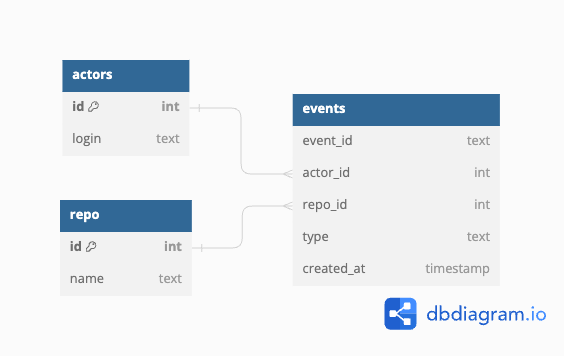

## Project description
This project aims to extract data from github events JSON files and load into the created tables. The data model is as shown below :



## Instruction

### establish docker configurations via docker-compose.yml file
```
docker-compose up
```

### install essential library
```
pip install psycopg2
```

### create tables (actors, repo, events)
```
python create_tables.py
```

### ETL from json files in folder 'data'
```
python etl.py
```